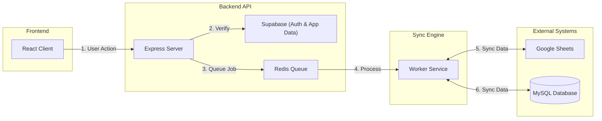

# SyncHub: Google Sheets ↔ MySQL Sync Platform


SyncHub is a production-grade, multi-tenant SaaS platform engineered for reliable, bidirectional synchronization between Google Sheets and MySQL databases. It solves the "data silo" problem by treating Sheets as a dynamic UI for your database and your database as a robust backend for your Sheets.


## 💡 How It Works (The Concept)

SyncHub acts as a **smart bridge** between your Google Sheet and MySQL Database.

1.  **You Connect**: Link your Google Account and MySQL Database.
2.  **You Map**: Tell SyncHub which Sheet columns match which Database columns (e.g., "Email" in Sheet = `user_email` in MySQL).
3.  **We Sync**:
    *   **Sheet → MySQL**: When you add a row in the Sheet, SyncHub inserts it into MySQL.
    *   **MySQL → Sheet**: When your app updates the database, SyncHub updates the cell in the Sheet.
    
It employs a custom **Change Data Capture (CDC)** module to detect modifications. By diffing the current state against the snapshot of the previous sync, it precisely identifies created, updated, and deleted records without needing database triggers.

## ✨ Key Features

- **🔄 True Bidirectional Sync**: Changes in Sheets reflect in MySQL, and database updates push to Sheets in real-time.
- **🛡️ Enterprise Security**:
    - **Cloudflare Turnstile** protection on authentication.
    - **AES-256-GCM** encryption for all sensitive credentials at rest.
    - **OAuth 2.0** integration for secure Google access.
- **🏗️ Robust Architecture**:
    - **Event-Driven Architecture (EDA)**: Fully asynchronous, non-blocking sync jobs powered by **BullMQ** & **Redis** to ensure high scalability.
    - **Atomic Operations**: MySQL transactions ensure data integrity.
    - **Auto-Recovery**: Automatic retries with exponential backoff for failed sync jobs (e.g., API timeouts).
    - **Constraint Protection**: Prevents deletion of active connections to maintain foreign key integrity.
- **🧩 Smart Conflict Resolution**: Configurable strategies (Latest Wins, Sheet Wins, DB Wins) to handle concurrent edits.
- **👥 Multi-Tenancy**: Complete data isolation between accounts using Row Level Security (RLS) patterns.
- **🛡️ Data Integrity & Safety**:
    - **Empty Source Validation**: Intelligent "No Column" checks prevent syncing from empty sources, protecting against data wipes.
    - **Dynamic Initial Source**: Explicit control over which side (Sheet vs MySQL) acts as the "Source of Truth" during initial setup.
    - **One-Way Enforcement**: Strict validation blocking syncs from empty sources to populated destinations.

## 🛠️ Tech Stack

### Frontend (Client)
- **Framework**: [React 18](https://react.dev/) + [Vite](https://vitejs.dev/)
- **Language**: TypeScript
- **State Management**: [Zustand](https://github.com/pmndrs/zustand)
- **Styling**: Modern CSS Variables & Responsive Design
- **Security**: [Cloudflare Turnstile](https://www.cloudflare.com/products/turnstile/) (Captcha replacement)
- **UI Components**: [Lucide React](https://lucide.dev/) Icons

### Backend (Server)
- **Runtime**: Node.js
- **Framework**: [Express.js](https://expressjs.com/)
- **Language**: TypeScript
- **Database**: [MySQL](https://www.mysql.com/) (User Data) + [Supabase](https://supabase.com/) (Auth/Meta)
- **Queue System**: [BullMQ](https://docs.bullmq.io/) on [Redis](https://redis.io/)
- **Validation**: [Zod](https://zod.dev/) for runtime schema validation
- **Auth**: Supabase Auth (JWT) + [JOSE](https://github.com/panva/jose)

## 🏗️ System Architecture

Running on a decoupled client-server architecture, communicating via RESTful APIs.



## 🚀 Getting Started

### Prerequisites
- Node.js 18+
- Redis (local or remote)
- MySQL Server
- Supabase Project
- Google Cloud Console Project (with Sheets & Drive APIs enabled)

### Installation

1.  **Clone the repository**
    ```bash
    git clone https://github.com/yourusername/synchub.git
    cd synchub
    ```

2.  **Install dependencies** (Root, Client, and Server)
    ```bash
    npm install
    ```

3.  **Environment Configuration**
    Create `.env` files based on the examples:
    ```bash
    cp .env.example .env
    cp client/.env.example client/.env
    ```
    *Fill in your Supabase keys, Google OAuth credentials, MySQL connection, and Redis URL.*

4.  **Database Setup**
    - Run the schema migration script located in `supabase/schema.sql` against your Supabase PostgreSQL instance.
    - Ensure your local/remote MySQL instance is running.

5.  **Start the Application**
    ```bash
    npm run dev
    ```
    This concurrently starts:
    - **Frontend**: http://localhost:5173
    - **Backend**: http://localhost:3001

## 🔄 Sync Workflow

The synchronization engine is the core of SyncHub. Here is how it handles data consistency:

1.  **Trigger**: User initiates sync manually, or a scheduled job fires.
2.  **Snapshot**: The worker fetches the current state of the Google Sheet and the MySQL Table.
3.  **Diffing**: A hash-based comparison identifies new rows, modified cells, and deleted records.
4.  **Resolution**: Conflicts are resolved based on the integration's settings.
5.  **Execution**:
    - **To Sheet**: Batch updates are sent to Google Sheets API.
    - **To MySQL**: Bulk `INSERT`/`UPDATE`/`DELETE` queries are executed in a transaction.
6.  **Audit**: The operation is logged in the `sync_history` table.

## 📸 Interface

### Data Table View
Manage your synced data visually with supported CRUD operations.


## 🔐 Security & Compliance

- **JWT Authentication**: Stateless authentication using Supabase.
- **Input Validation**: All API inputs are strictly validated using Zod schemas.
- **Bot Protection**: Login and Signup endpoints are protected by Cloudflare Turnstile.
- **Credential Encryption**: Database credentials for user's MySQL connections are never stored in plain text.

### Demo Database
Want to try it out? Use this read-only MySQL database to test the connection:
- **Host**: `switchyard.proxy.rlwy.net`
- **Port**: `31470`
- **User**: `root`
- **Password**: `sBxhTgikZNAEEuOSMhaZsJeGIzqqQtYS`
- **Protocol**: TCP (Railway)

## 📝 License

This project is licensed under the MIT License - see the [LICENSE](LICENSE) file for details.
